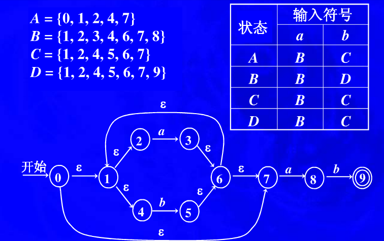
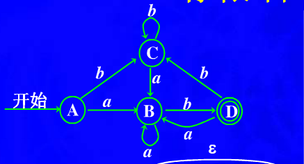

# Simple Regular Expression Implimentaion


## TODO
* DONE determine optimization
* DONE label_set optimization
* DONE fsm trim

## Regex BNF
```
alpha  -> 'a'-'z' 'A'-'Z' '.'
concat -> alpha | a
          alpha '-' alpha # a-z
factor -> alpha |
          '(' alpha+ ')' |
          '[' concat ']'
expr -> factorfactor | #连接运算
     -> factor '*' #*运算
     -> factor '+' #+运算
     -> factor '|' factor #或运算
exprs -> expr exprs
```

## FSM Determine Example
look at the fsm-test.cc:test_determine() function




